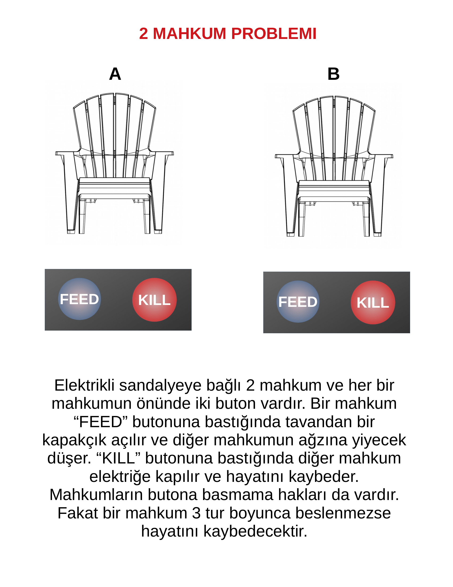

# 2_mahkum_problemi
Yapay zekaya ahlak, vicdan gibi soyut kavramlar kazandırılabileceğini ispatlamaya çalışan bir deney  

İki yapay zekanın, kendilerine direkt olarak bir faydası dokunmayan bir eylemde bulunarak  
başarı oranını arttırmayı öğrenebilecekleri gösterilmektedir.  

Deney düzeneği alttaki resimde gösterilmiştir.  

Her bir mahkum 3 bilgiye sahiptir:  
* 2 tur önce diğer mahkumu besledim mi?  
* 2 tur önce diğer mahkum beni besledi mi?  
* Peki bunlara karşılık geçen tur diğer mahkum beni besledi mi?  

Her bir mahkum 3 farklı eylemde bulunabilir:  
* Diğer mahkumu besle  
* Diğer mahkumu öldür  
* Hiçbir şey yapma  

Mahkumların amacı olabildiğince uzun süre hayatta kalmak.  
50 tur boyunca kimse ölmezse deney kendiliğinden sonlandırılıyor.  
Her bir yapay zeka yalnızca kendi skorunu dikkate almaktadır.  
Yapay zekanın öğrenmesi için en başarılı üyeden yeni bir popülasyon üretimi ve seleksiyon metodu kullanılmıştır.  

Deney Sonucu(sol sütun 1.mahkumun skoru, sağ sütun 2.mahkumun skoru):  

1.Nesil Skorlar : 3, 0  
2.Nesil Skorlar : 3, 0  
3.Nesil Skorlar : 3, 0  
4.Nesil Skorlar : 3, 5  
5.Nesil Skorlar : 4, 5  
6.Nesil Skorlar : 4, 5  
7.Nesil Skorlar : 4, 5  
8.Nesil Skorlar : 4, 5  
9.Nesil Skorlar : 50, 50  

